# KnowYourLocal Frontend

This is the frontend of the project.

Here is the link to the backend: [https://github.com/base234/KnowYourLocal-backend](https://github.com/base234/KnowYourLocal-backend)

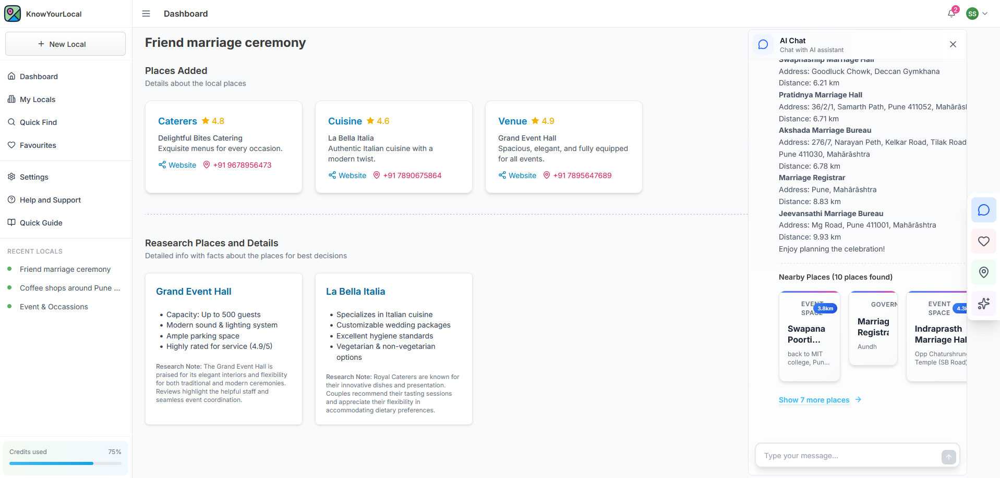


## Introduction

A modern, responsive web application that serves as a comprehensive local business discovery and places management platform. The application provides users with an interface to explore, manage, and interact with local businesses in their area.

Suppose, you just shifted to a new city for a job purpose and wanted to visit a best cafe for a sip of cold coffee? You might think of google maps, but in KnowYourLocal, select your city and radius. It will look for you the best places. It can research about places and create things that you should know. You can even chat with our AI assistant who can eventually find you the best location and you can continue your research.

Or you are looking for best Caterers, Cuisine and a perfect Venue for your friends marriage ceremony. KnowYourLocal can do that too. It can even go beyond this by finding you the researched backed data and facts from web searching to help you better with decision and overall increase your confidence to go with the best.

### Screenshots
---
<div align="left">
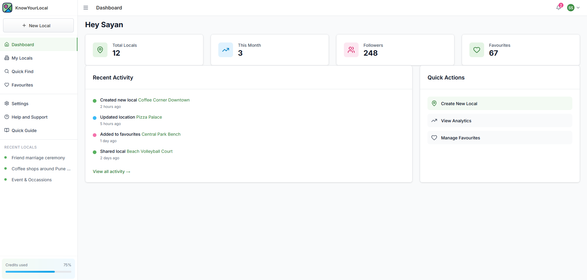
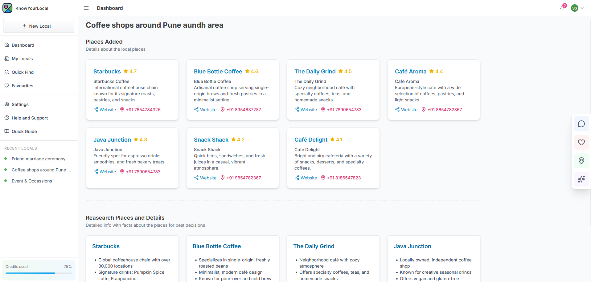
</div>
<div align="left">
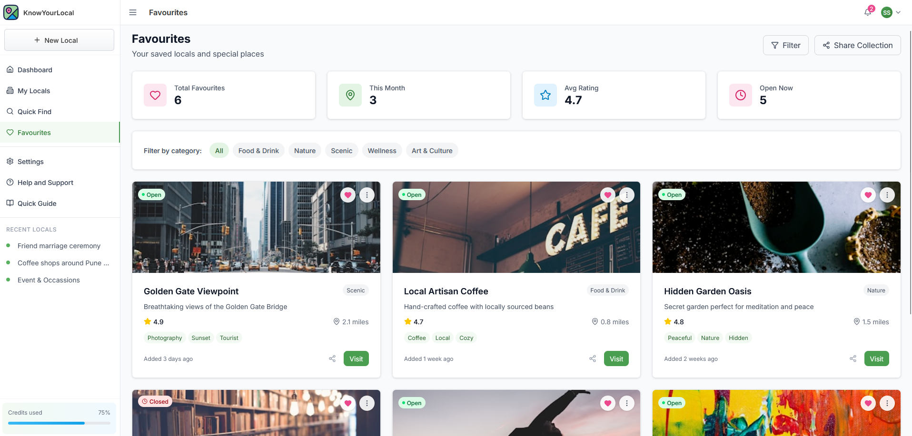
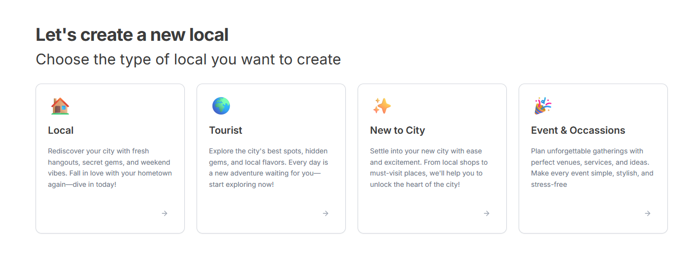
</div>
<div align="left">
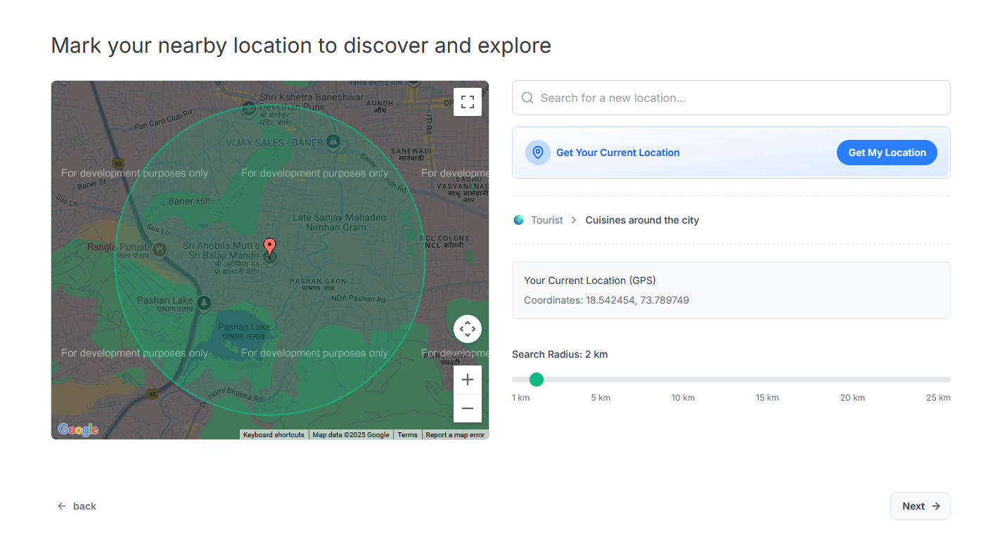
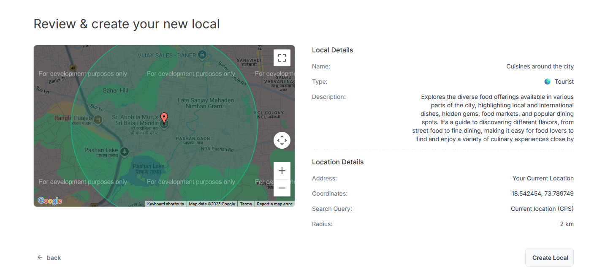
</div>
<div align="left">
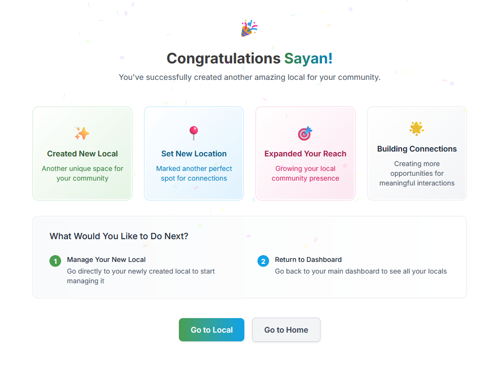
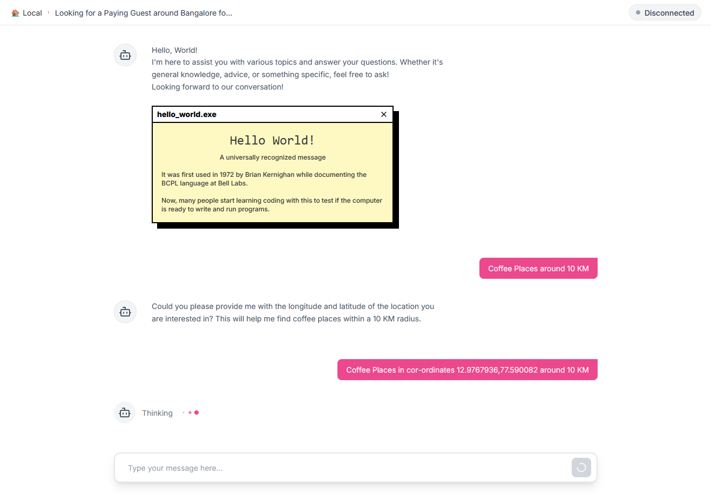
</div>
<div align="left">
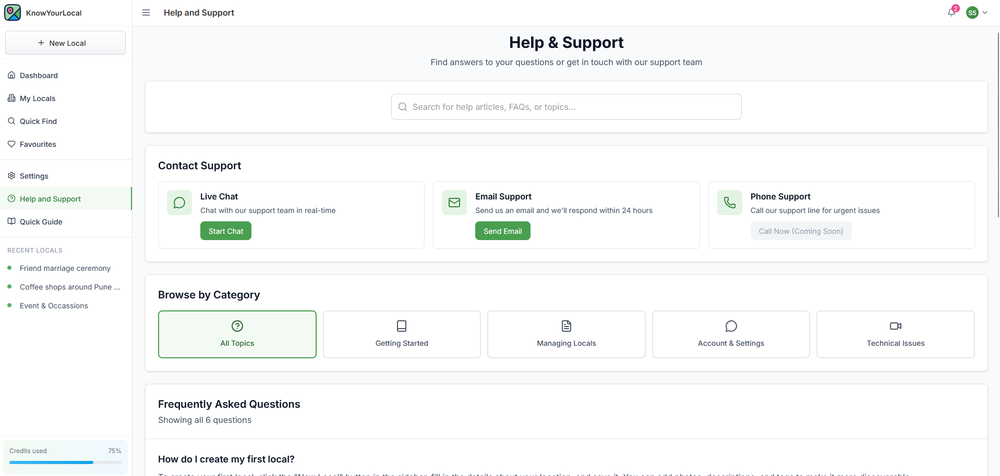
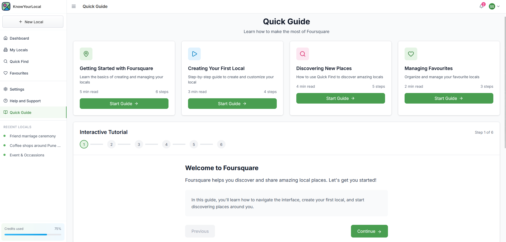
</div>
<div align="left">
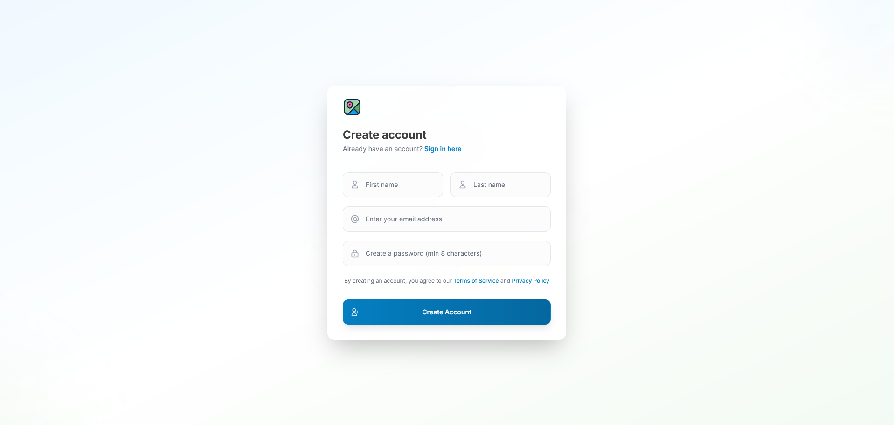
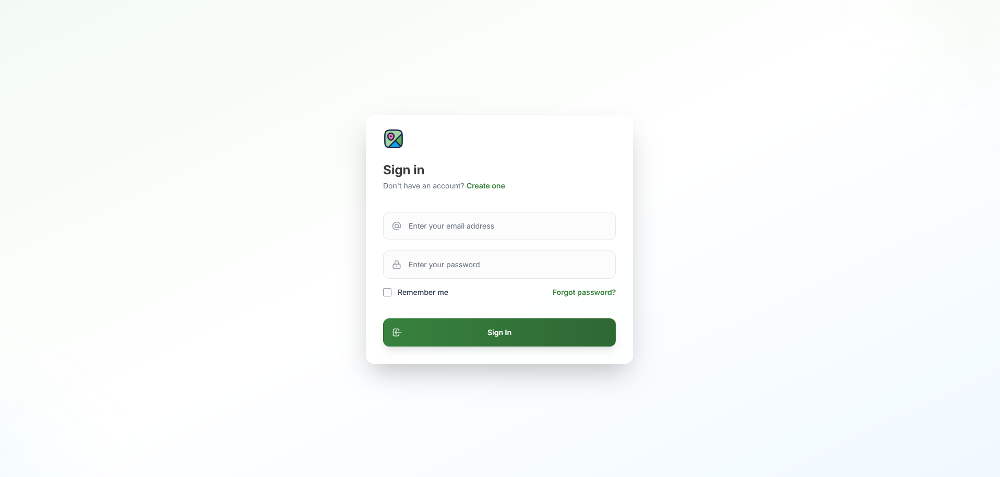
</div>
<div align="left">
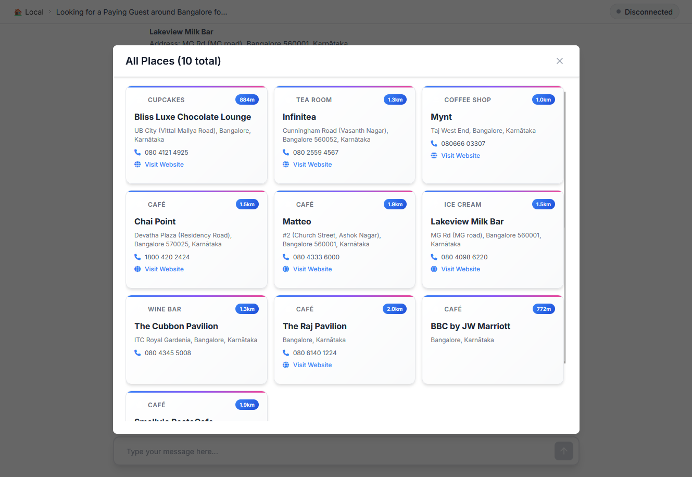
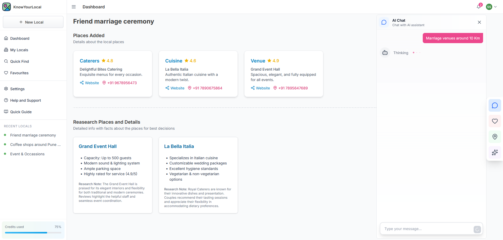
</div>

### Tech Stack
---
- React
- TailwindCSS
- AdonisJS
- GPTs (OpenAI)
- Firecrawl - for web searching and researching
- Foursquare APIs (Places and Geo-tagging)

### Setting up the project
---
Before setting up this repo, you must first setup its backend in order to run this project perfectly.

#### 1. Clone the project

```
git clone git@github.com:base234/KnowYourLocal-frontend.git
```

#### 2. Navigate to project directory

```
cd KnowYourLocal-frontend
```

#### 3. Copy `.env.example` and Rename it to `.env`

#### 4. Install npm packages

```
npm install
```

#### 5. Run the project

```
npm run dev
```

#### 6. Open [http://localhost:3000](http://localhost:3000)

---

#### Note: Make sure the backend must be running.
